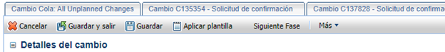

[Volver al Inicio](../../README.md)
---
# APLICACIONES


## 1. Detalles del Cambio

- **Ambiente**: Producción
- **CI afectado** : `APLNEG100249` (Servidor RK) o `APLNEG100087` (Servidor OB)
- **Descripción** : Req `<Folio de requerimiento>` - Manuales de Usuarios `<proyecto>`
- **Información** : Informacion audio visual como lo son manuales e instructivos para los usuarios finales. `Texto referente al proyecto`
- **Tipificación**: Cambio a Aplicaciones - Cambios en funcionalidad en módulos existentes
<div style="text-align: center;">
    
</div>

## 2. Datos Adjuntos
Para Generar el formato DRI se debe diligenciar el siguiente: [Formulario](https://cuestionariodri.azurewebsites.net/)
- **Aplicacion afectada**: `I-033` (RK) `I-016` (OB)
- [Descargar DRI EJEMPLO](../../Documentos/DRI%20aplication%20R-59539.pdf)

<div style="text-align: center;">
    
</div>

<br>

**Nota**:El Archivo debe ser diligenciado desde el formulario obligatoriamente.

## 3. Seccion General
<div style="text-align: center;">
    
</div>

**Nota**: Los valores de Riesgo, Impacto, Urgencia corresponden a los valores generados en el formulario del paso anterior. 

**No. Requerimiento**: `<Folio de requerimiento>`

## 3. Guardar el Cambio

<div style="text-align: center;">
    
</div>

- **Grupo de trabajo**: COORDINADORES DE CAMBIOS
- **Persona Asignada**: PABLO CIRILO

- Realizar la el cambio de fase a evaluación

- Presionar sobre el botón guardar

## 4. Tareas
Luego de guardar se generaran las tareas donde debemos realizar pasos previos, para poder completar los hitos.
<div style="text-align: center;">
    
</div>

- Generar el commit a la rama correspondiente en TFS de alli se obitene el campo `change set` = `Conjunto de cambio` en la tabla de la siguiente imagen
<div style="text-align: center;">
    
</div>

- Completar los formularios:
  - **Record Keeping**: [Traspaso](../../Documentos/RK/Formato%20Unico%20Release%20Traspaso_59539.xlsx), [Compilacion](../../Documentos/RK/Formato%20Unico%20Release%20Compilacion_59539.xlsx)
  - **Onboarding**:  [Traspaso](../../Documentos/OB/Formato%20Unico%20Release_Traspaso_59539.xlsx), [Compilacion](../../Documentos/OB/Formato%20Unico%20Release%20Compilacion_59539.xlsx)
  
  **Nota**: Se debe cambiar los nombres del archivo teniendo en cuenta el campo  `<Folio de requerimiento>`
  - Archivo Traspaso:  `Formato_Unico_Release_Traspaso_<Folio de requerimiento>.xlsx`
  - Archivo Compilación:  `Formato_Unico_Release_Compilacion_<Folio de requerimiento>.xlsx`
    
---
- **Mensaje RK** <br>
**Descripción**: Tarea para solicitar una compilación y/o despliegue en pruebas

**Información**:
```text
En el Servidor de Azure DevOps MXSURAVMW15099\IIMM,con Visual studio 2019.

1 - Obtener la versión correspondiente al ChangeSet No. 12124 de la carpeta: I-033RK\2 - QA\Source.
2 - Realizar las tareas indicadas en el archivo Release Compilación
3 - Realizar las tareas indicadas en el archivo Release Traspaso
```
**Grupo de Trabajo**: BIBLIOTECARIOS

**Persona Asignada**: CAPEL MONROY OLIVER FERNANDO

**No. Requerimiento**: `<Folio de requerimiento>`

<div style="text-align: center;">
    
</div>

- **Mensaje OB** <br>
**Descripción**: Tarea para solicitar una compilación y/o despliegue en pruebas

**Grupo de Trabajo**: BIBLIOTECARIOS

**Persona Asignada**: ORTIZ DE LA FUENTE ALEJANDRA

**No. Requerimiento**: `<Folio de requerimiento>`
<div style="text-align: center;">
    
</div>

**Información**:
```text
1 - Obtener la versión correspondiente al ChangeSet No 12134 de la carpeta: I-016\QA\
2 - Realizar las tareas indicadas en el archivo Release Compilación
3 - Realizar las tareas indicadas en el archivo Release Traspaso
```

**Nota**:  
    - En caso de que la compilacion deba realizarce de forma manual para onboarding se debe compilar y subir los archivos a las rutas indicadas en el sigueinte mensaje.
    - Luego de subir los compilados se debe enviar un correo a la persona encargada con el mensaje.
---
**Para**: PABLO CIRILO 

**Copia**: ORTIZ DE LA FUENTE ALEJANDRA

**Mensaje**: <br>
Hola, buenas tardes,

Comparto la información para el despliegue en el ambiente de QA del proyecto Onboarding.

Rutas de los compilados:
* Servicios: \\MXSURAIMW10157\Release2019\Prod\Onboarding\wcf
* Sitio Web: \\MXSURAIMW10157\Release2019\Prod\Onboarding\web
<br>
  El despliegue deberá realizarse manualmente, copiando los compilados a las rutas adecuadas en el servidor QA desde las rutas especificadas en la tabla. Esto se debe a que no se pudo realizar el despliegue directo desde el servidor como se hace usualmente.
  Al intentar realizar el proceso, aparece un mensaje de incompatibilidad en Visual Studio (ver imagen adjunta). Esto puede deberse a la falta de instalaciones o actualizaciones necesarias para el SDK de .NET Framework 4.8, pero esta situación deberá ser validada por el área encargada.
  Adjunto las capturas relevantes para su revisión:
Imagen: Error en Visual Studio.
<div style="text-align: center;">
    
</div>

| No. | RUTA ORIGEN                                    | SERVIDOR       | RUTA DESTINO                 | PROGRAMAS                           |
|-----|------------------------------------------------|----------------|------------------------------|-------------------------------------|
| 1   | //mxsuraimw10157/Release2019/QA/OnBoarding/web | MXSURAIMW10109 | //mxsuraimw10109/E$/www/Onboarding/Web       | Excepto (Archivos saml.config)     |
| 2   | //mxsuraimw10157/Release2019/QA/OnBoarding/wcf | MXSURAIMW10108 | //mxsuraimw10108/E$/www/Onboarding/Services    | Excepto (web.config)               |


Solicitud:
Agradezco de antemano si nos pueden otorgar la aprobación para proceder y, en caso de ser aprobada, reenviar este correo al área encargada del despliegue para que se pueda realizar el movimiento en las rutas indicadas.
Quedo atento a cualquier duda o requerimiento adicional.
Saludos cordiales,


Moises Abuabara
MXE01033615A
---

- Si se requiere realizar la modificacion del webconfig, se debe obtener una copia, original y agregar las cadenas de conexion correspondiente
para esto se debe hablar con alguien que tenga permisos, o pedirle al encargado que nos facilite una copia.
---

---

- Adjuntar: Archivos compilacion y Traspaso...

<div style="text-align: center;">
    
</div>

- Guardar la tarea
    

---

[Volver al Inicio](../../README.md)