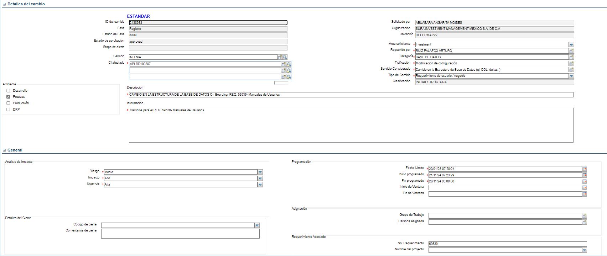
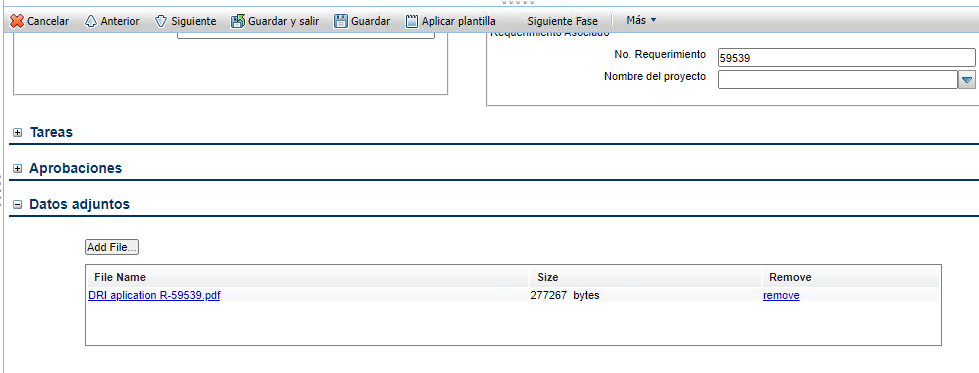
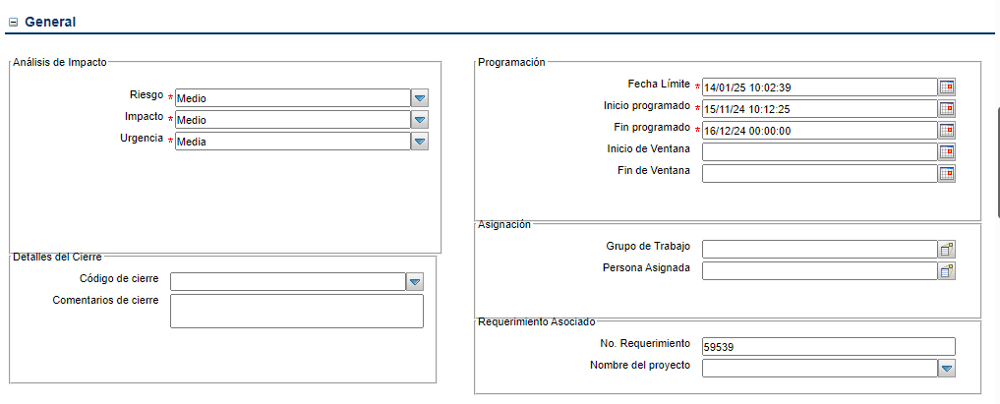
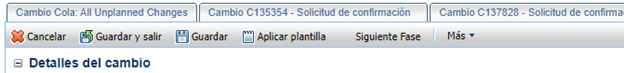
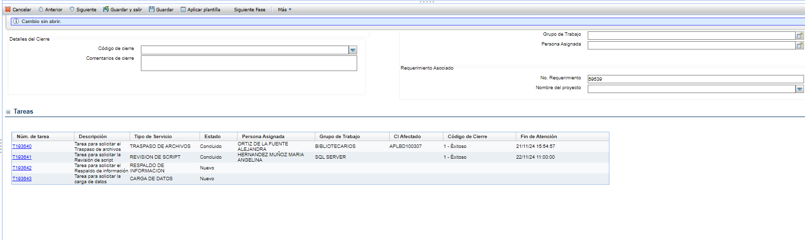
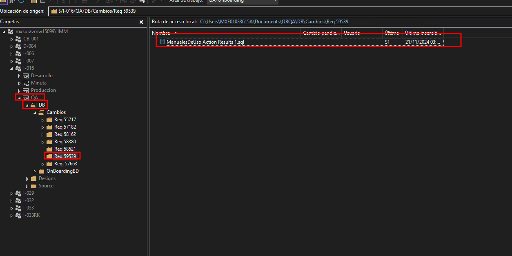
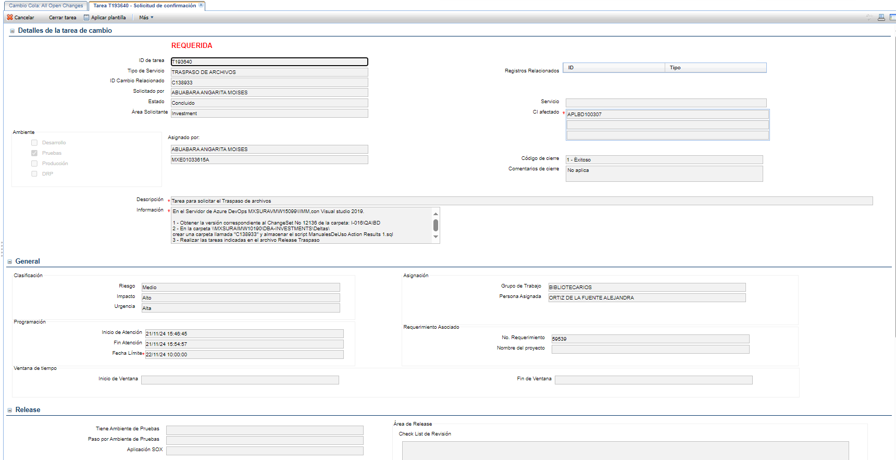
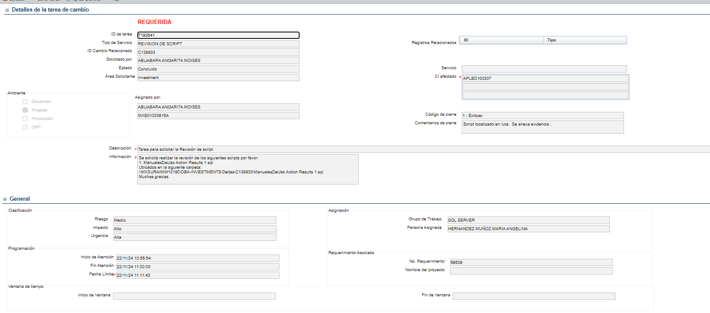
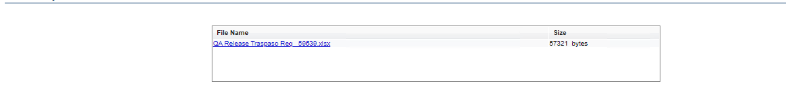

[Volver al Inicio](../../readme.md)
---
# BASE DE DATOS


## 1. Detalles del Cambio

- **Ambiente**: Producción
- **CI afectado** : `SERVINTL101277` (Servidor RK) o `APLBD100307` (Servidor OB)
- **Categoría**: BASE DE DATOS
- **Tipificación**: Modificación de configuración
- **Servicio Considerado**: Cambio en la Estructura de Base de Datos (ej. DDL, deltas, )
- **Tipo de Cambio**: Requerimiento de usuario / negocio
<br>
- **Descripción** : CAMBIO EN LA ESTRUCTURA DE LA BASE DE DATOS On Boarding, REQ. `<Folio de requerimiento>`- `<proyecto>`
- **Información**: Cambios para el REQ. `<Folio de requerimiento>` - `<proyecto>`.

<div style="text-align: center;">
    
</div>

## 2. Datos Adjuntos
- **Record Keeping**: 
- **Onboarding**: [Descargar DRI BD](../../Documentos/DRI%20aplication%20R-59539.pdf)

Renombrar el archivo a: `DIR DB R-<Folio de requerimiento> <PROJECTO> <QA>`
<div style="text-align: center;">
    
</div>

<br>

**Nota**:El Archivo debe ser diligenciado desde el formulario obligatoriamente.

## 3. Seccion General
<div style="text-align: center;">
    
</div>

**Nota**: Los valores de Riesgo, Impacto, Urgencia corresponden a los valores generados en el formulario del paso anterior.

**No. Requerimiento**: `<Folio de requerimiento>`

## 3. Guardar el Cambio

<div style="text-align: center;">
    
</div>


- **Grupo de trabajo**: COORDINADORES DE CAMBIOS
- **Persona Asignada**: PABLO CIRILO

- Realizar la el cambio de fase a evaluación

- Presionar sobre el botón guardar

## 4. Tareas
Luego de guardar se generaran las tareas donde debemos realizar pasos previos, para poder completar los hitos.
<div style="text-align: center;">
    
</div>

### Onboarding
- Traspasos de archivos por medio del TFS y usado el `<Folio de requerimiento>`
    <div style="text-align: center;">
        
    </div>
    
    **Descripción**: Tarea para solicitar el Traspaso de archivos
    
    **Información**:
    ```text
    En el Servidor de Azure DevOps MXSURAVMW15099\IIMM,con Visual studio 2019.
    
    1 - Obtener la versión correspondiente al ChangeSet No 12136 de la carpeta: I-016\QA\BD
    2 - En la carpeta \\MXSURAIMW10190\DBA-INVESTMENTS\Deltas\
    crear una carpeta llamada "C138933" y almacenar el script ManualesDeUso Action Results 1.sql
    3 - Realizar las tareas indicadas en el archivo Release Traspaso
    ```
    **Nota**: Se debe reemplazar "C138933" por el `id_cambio al crear la solicitud`, se debe cambiar "12136" por el `changeset` al moemnto de subirlos archivos al TFS
    **Grupo de Trabajo**: BIBLIOTECARIOS
    
    **Persona Asignada**: ORTIZ DE LA FUENTE ALEJANDRA
    
    **No. Requerimiento**: `<Folio de requerimiento>`

    <div style="text-align: center;">
            
    </div>

- Enviar Correo a BEATRIZ MOSES
    Adjuntar el achivo [Descargar DRI BD](../../Documentos/DRI%20aplication%20R-59539.pdf) en el cuerpo del correo

    ```text
    Hola buen día Beatriz.
    
    Me puedes ayudar con tu correo del VoBo para liberar cambios de base de datos en QA de OnBoarding.
    Favor de responderlo con el siguiente mensaje, ya lo deje prellenado.
    
    Cordialmente,
    
    Moises Abuabara
    MXE01033615A
    
    -----------------------------------------------------------------------------------------------------------------------------------------------------------------------------------
    Buen día: 
    
    En mi carácter de propietario / custodio de la aplicación < I-016 OnBoarding > autorizo la ejecución de los siguientes scripts en ambiente de <pruebas> solicitados en el Requerimiento<59539>, en la ventana de tiempo del <lunes 25 de Noviembre al lunes 9 de Diciembre del 2024 de 09:00 h a 19:00 h> 
    
    RUTA: 
    \\MXSURAIMW10190\DBA-INVESTMENTS\Deltas\C138933\
    
    OBJETO: ManualesDeUso Action Results 1.sql
    ```

- Revision del script

  **Descripción**: Tarea para solicitar la Revisión de script

  **Información**:
    ```text
    Se solicita realizar la revisión de los siguientes scripts por favor:
    1. <nombre_archivo>.sql
       Ubicados en la siguiente carpeta:
       \\MXSURAIMW10190\DBA-INVESTMENTS\Deltas\<id_cambio>\<nombre_archivo>.sql
       Muchas gracias.
    ```
  <br>
  **Nota**: Se debe reemplazar "C138933" por el `id_cambio al crear la solicitud`, se debe cambiar "12136" por el `changeset` al moemnto de subirlos archivos al TFS
  **Grupo de Trabajo**: BIBLIOTECARIOS

  **Persona Asignada**: ORTIZ DE LA FUENTE ALEJANDRA

  **No. Requerimiento**: `<Folio de requerimiento>`
    <div style="text-align: center;">
            
    </div>
### Record Keeping
.
.
.
---

- Adjuntar: Archivo de Traspaso [Onboarding](../../Documentos/OB/QA%20Release%20Traspaso%20Req%20_59539.xlsx)

<div style="text-align: center;">
    
</div>

- Guardar la tarea

---

[Volver al Inicio](../../readme.md)
