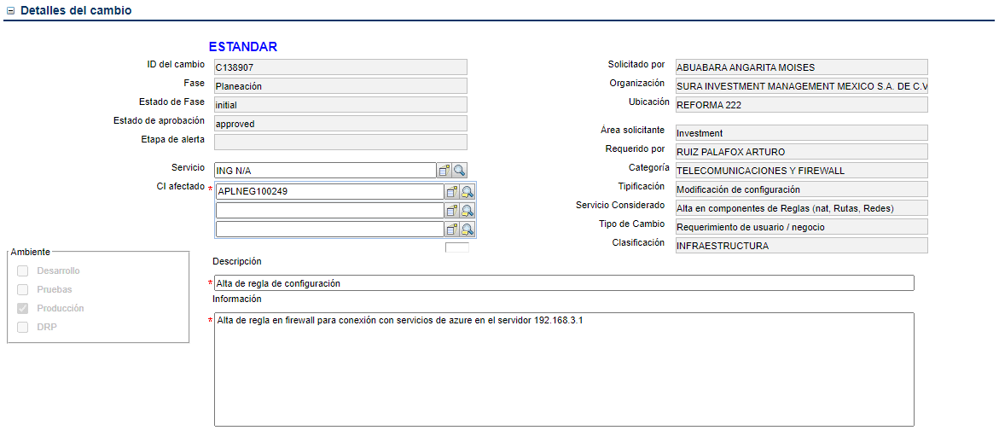
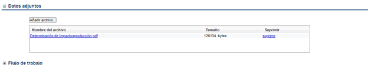
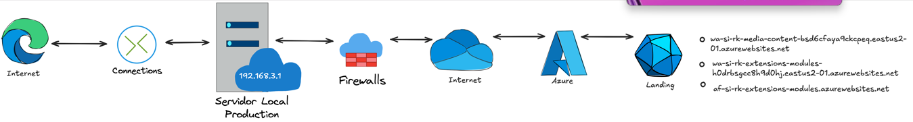
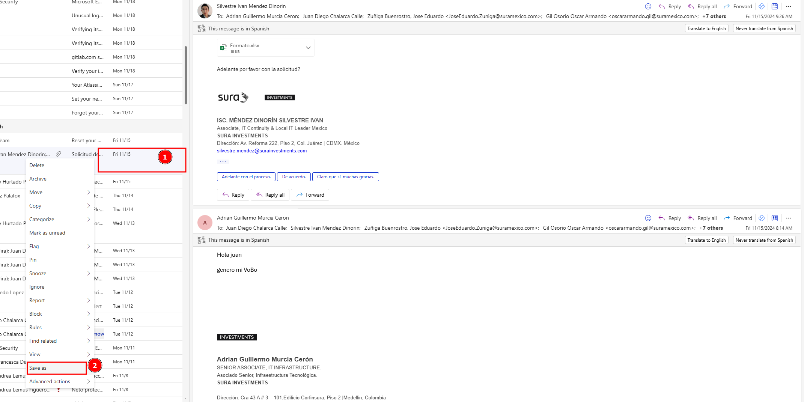
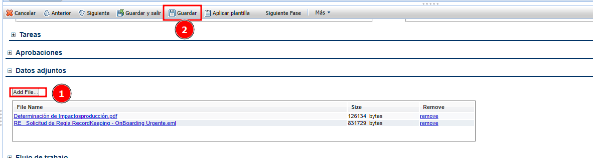
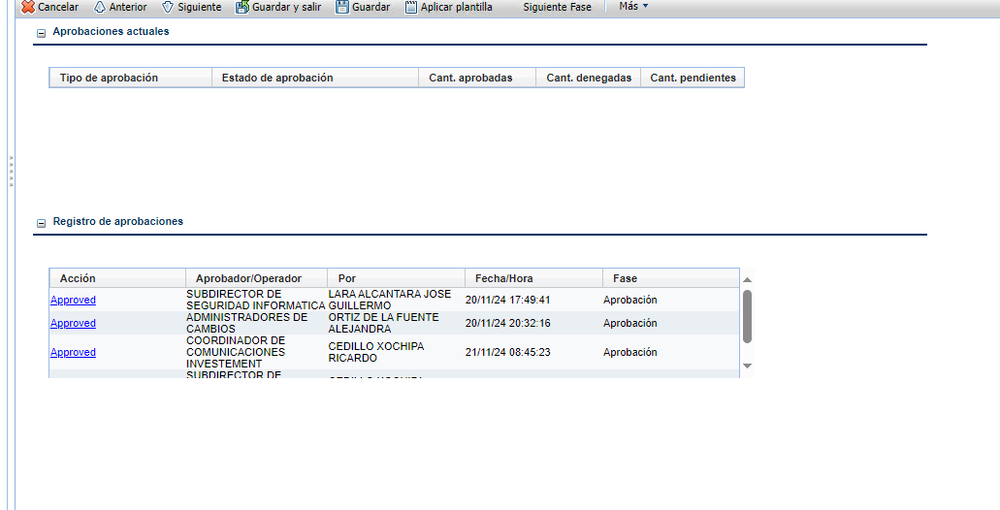
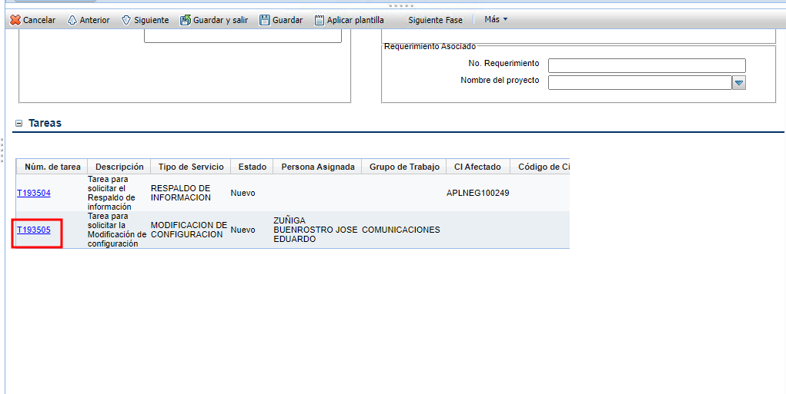
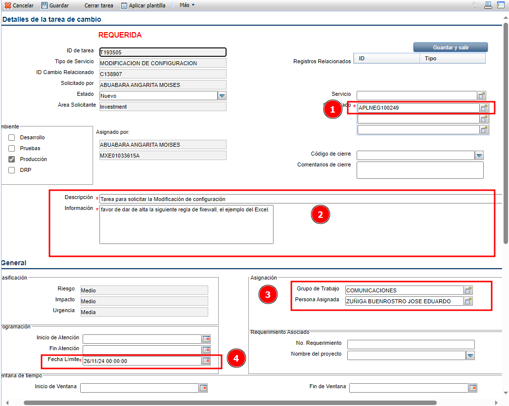
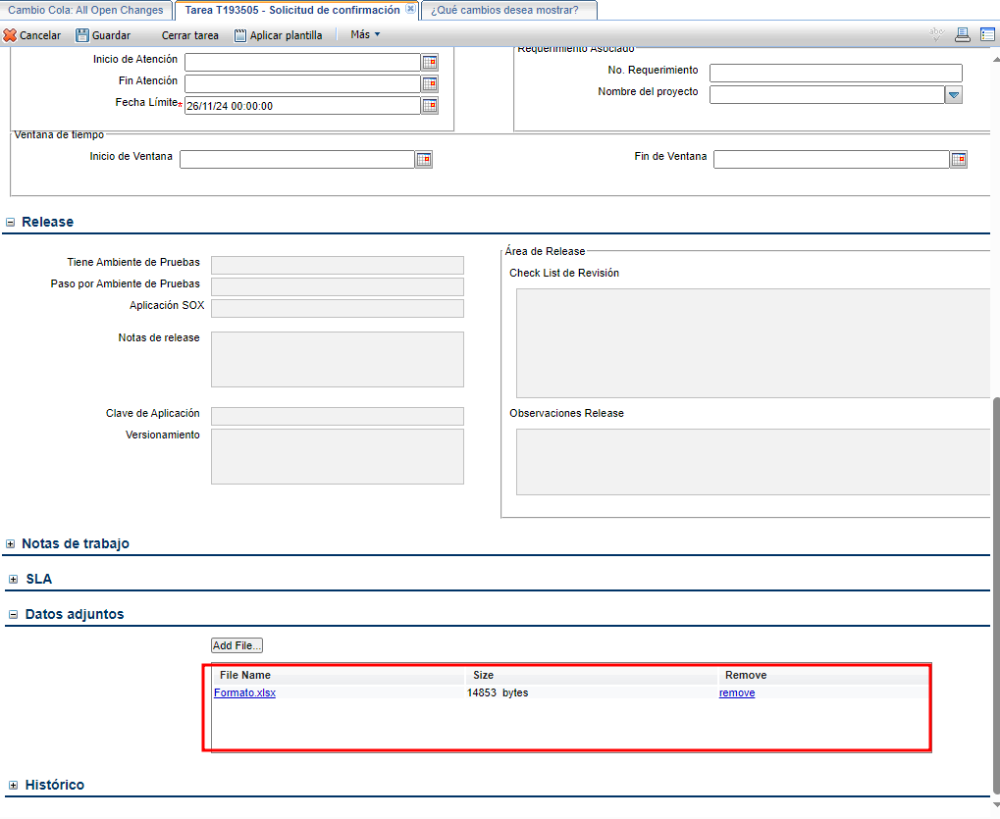

[Volver al Inicio](../../README.md)
---
# Telecomunicaciones y Firewall

## 1. Detalles del Cambio

- **Ambiente**: Producción
- **CI afectado**: APLNEG100249 (Servidor compartido RK/OB)
- **Descripción**: Alta de regla de configuración
- **Información**: Alta de regla en firewall para conexión con servicios de Azure en el servidor `<ip_servidor>`.

    

## 2. Datos Adjuntos

- [Descargar DRI FIREWALL](../../Documentos/DRI_firewall.pdf)

    

## 3. Guardar el Cambio

    

## 4. Enviar correo (configuración/Vo.Bo)

- Contenido del correo
---
Buen día

@Zuñiga Buenrostro, Jose Eduardo, @Victor Hugo Hernandez Sepulveda y @Osvaldo Torres Ramirez

Solicitamos de su amable ayuda en realizar la configuración respectiva para habilitar la conexión entre servicios de OnBoarding y RecordKeeping hacía AZURE en base al documento adjunto, esto lo necesitamos para la conexión de algunos servicios utilizados para los temas de Materiales de Capacitación y Minuta Operativa del proyecto RK2.0.

URLs a habilitar:
- **Landing**   : wa-si-rk-media-content-bsd6cfaya9ckcpeq.eastus2-01.azurewebsites.net
- **API**       : wa-si-rk-extensions-modules-h0drbsgcc8h9d0hj.eastus2-01.azurewebsites.net
- **Traductor** : af-si-rk-extensions-modules.azurewebsites.net

**Ambientes**:
- **IP PRD** :192.168.3.1 (MXSURAIMW10117)

Los cambios que sustentan dicha solicitud son los siguientes:

    

PRD:  C138883

@Adrian Guillermo Murcia Ceron y @Silvestre Ivan Mendez Dinorin nos ayudan por favor con su VoBo.

De antemano muchas gracias por el apoyo. 
Saludos
---

- Adjuntar el siguiente formato diligenciando el requerimiento [Descargar Formato_Solicitud_Firewall](../../Documentos/formato_solicitud_firewall.xlsx)
### 5. Descargar correo con el Vo.Bo y Subir a adjuntos
- Descargar el correo desde la bandeja de entrada presionando clic derecho y posteriormente `Save as`

    

- Subir el correo a datos adjuntos en el cambio creado en pasos anteriores

    

- Diligenciar la sección General en el cambio de service manager

    

- **Grupo de trabajo**: COORDINADORES DE CAMBIOS
- **Persona Asignada**: PABLO CIRILO

- Realizar la el cambio de fase a evaluación 

- Presionar sobre el botón guardar

### 6. Esperar cambio de fase a aprobación por parte del coordinador de cambios
en esta fase se requiere la aprobación de:
- ADMINISTRADOR DE CAMBIOS
- COORDINADOR DE COMUNICACIONES
- SUBDIRECTOR DE INFRAESTRUCTURA
- SEGURIDAD INFORMATICA

    

Se debe ser paciente y esperar la aprobación por parte de las áreas encargas para continuar con el proceso

### 7. Asignar la tarea para dar de alta las reglas solicitadas.
- Desplazarse hasta la seccion `Tareas` y seleccionar la tarea correspondiente a `MODIFICACION DE CONFIGURACION`

    

- *Fecha Limite*: T+1
- *Asignación*: 
  - *Grupo de Trabajo*: COMUNICACIONES
  - *Persona Asignada*: ZUÑIGA BUENROSTRO JOSE EDUARDO

- Diligenciar los campos correspondientes a la tarea:

    

- Dentro de la tarea se debe adjuntar el formato enviado en el correo [Descargar Formato_Solicitud_Firewall](../../Documentos/formato_solicitud_firewall.xlsx)

    

- Presionar sobre el botón `Guardar` para almacenar la asignación de la tarea y posteriormente hacer clic sobre cancelar para regresar al menu anterior(Menu Cambio).
 
 

 
**Nota**:En este momenta la tarea cambiará a fase de planeación para hacerse efectiva y corroborar que funcione correctamente, si no funciona se debe contactar a la persona asignada en la tarea para solucionar el inconveniente.
---

[Volver al Inicio](../../README.md)