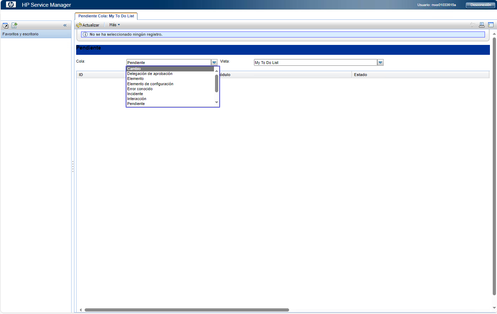
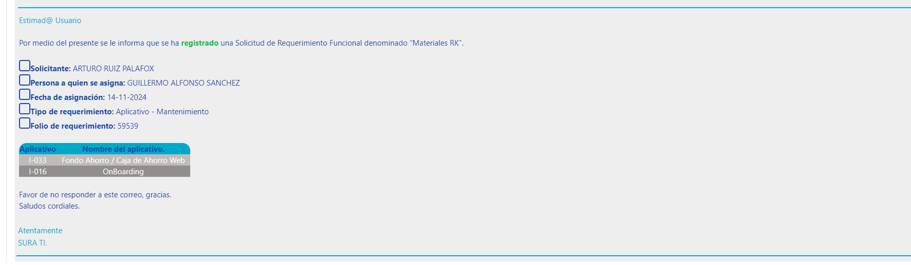

# Documentos, Solicitudes y/o Despliegues (Sura MX)

## Tabla de Contenido

1. [Introducción](#introducción)
2. [Pasos Generales](#pasos-generales)
    - [Tipos de Cambio](#tipos-de-cambio)
3. [Documentos Requeridos](#documentos-requeridos)
    - [Lista de formatos por proyecto](#lista-de-formatos-por-proyecto)

**Nota**: [Documento General Matriz Tipificacion](./Documentos/Matriz%20de%20Tipificación.xlsx)
---

## Introducción

Este manual está diseñado para centralizar la documentación y las guías necesarias para interactuar con HP Service Manager dentro del contexto de **Solicitudes y/o Despliegues (Sura MX)**.

---

## Pasos Generales

### Ingreso al portal

1. **URL: [HP Service Manager](https://mxsuravmw15022/SM-9.21/index.do)**

    

2. **Seleccionar cambio en el menú desplegable `Cola`**

    

---

### Tipos de Cambio

Para más detalles sobre cada tipo de cambio, consulta los siguientes documentos:

1. **[Telecomunicaciones y Firewall](./Markdowns/TipoDeCambio/Telecomunicaciones.md)**
   - No requiere número de requerimiento adicional.
2. **[Aplicaciones](./Markdowns/TipoDeCambio/Aplicaciones.md)**
   - **Requisito:** Debes tener un número de requerimiento, el cual puedes solicitar a la persona encargada. Ejemplo: `XXXXX` o `YYYYY`.
   - **Cómo identificar el número de requerimiento:**
     

         
     

   - Añade el número de requerimiento en el campo correspondiente antes de proceder `Folio de requerimiento`.
   - **[Manual cuestionario DRI](./Documentos/CAMBIOS%20DE%20APLICACION%20SERVICES%20MANAGER.docx)**
3. **[Base de Datos](./Markdowns/TipoDeCambio/BaseDeDatos.md)**

---
